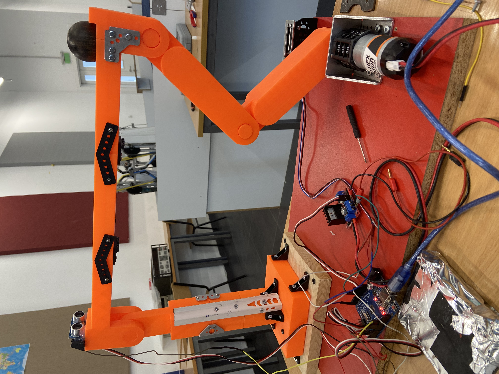
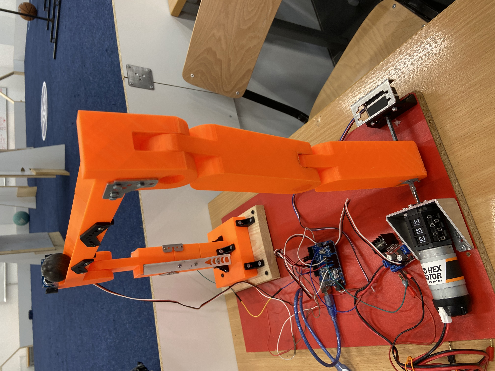
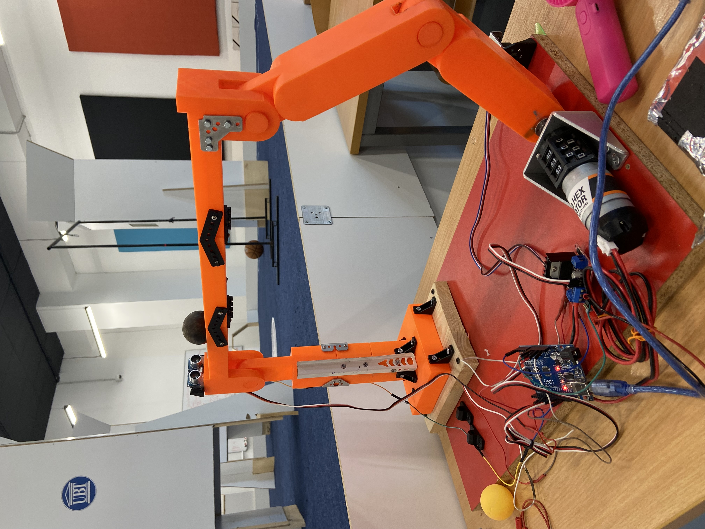

# Ball and Beam Control System Using Fuzzy Logic and PID Control

## Course
Fuzzy Logic and Control

---

## Project Description

This project presents the design and implementation of a Ball and Beam control system using a hybrid **Fuzzy Logic + PID control architecture** on an Arduino Uno platform.

The objective is to stabilize and control the position of a ball on a beam by adjusting the beam angle using a DC motor. The system combines:

- Intelligent decision-making (Fuzzy Logic)
- Precise feedback control (PID Controller)
- Real-time sensor fusion
- Embedded system implementation

This project demonstrates practical application of modern control techniques in a mechatronic system.

---

## System Overview

The system consists of two cascaded control loops:

### 1. Outer Loop – Fuzzy Logic Controller

The fuzzy controller calculates the desired beam angle based on:

- Position error
- Error rate (velocity of error)

**Error equation:**
```
e = x_target - x_actual
```

**Error rate:**
```
de/dt
```

**Output:**
```
θ_target (desired beam angle)
```

The fuzzy system uses membership functions and rule-based inference to generate the optimal control decision.

---

### 2. Inner Loop – PID Controller

The PID controller ensures the beam reaches the desired angle.

**Error:**
```
eθ = θ_target - θ_actual
```

**Control law:**
```
u(t) = Kp * e(t) + Ki * ∫e(t)dt + Kd * de(t)/dt
```

**Controller Gains:**

- Kp = 0.35  
- Ki = 0.03  
- Kd = 0.05  

---

## Hardware Components

- Arduino Uno
- HC-SR04 Ultrasonic Sensor
- Potentiometer (feedback sensor)
- DC Motor
- L298N Motor Driver
- External Power Supply

---

## Pin Configuration

### Ultrasonic Sensor
| Signal | Pin |
|--------|-----|
| Trigger | D5 |
| Echo | D6 |

### Potentiometer
| Signal | Pin |
|--------|-----|
| Output | A5 |

### Motor Driver
| Signal | Pin |
|--------|-----|
| PWM | D9 |
| IN1 | D10 |
| IN2 | D11 |

---

## Software Features

- Real-time distance measurement
- Low-pass filtering for sensors
- Fuzzy inference engine
- PID control loop
- PWM motor control
- Deadband compensation
- Noise reduction filtering
- Smooth angle tracking
- Error rate estimation

---

## Fuzzy Logic Design

### Input Membership Functions
- Negative
- Zero
- Positive

### Output Membership Functions
- Low Angle
- Flat Angle
- High Angle

The controller uses a **9-rule fuzzy inference system** to determine the beam angle.

---

## Experimental Setup

- Target ball position: **20 cm**
- Beam neutral angle: **145°**
- Operating range: **132° – 158°**

---

## System Demonstration

### Images







---

## Video Demonstration

📌 Full System Demo (High Quality Video)

👉 [Watch here](https://github.com/mehmetajlea/Ball-and-Beam-Fuzzy-PID-Control/releases/tag/v1.0)
---

## Results & Performance

- Stable ball positioning achieved
- Reduced oscillations due to filtering
- Smooth motor response via PID tuning
- Robust fuzzy decision-making

---

## Future Improvements

- Adaptive PID tuning
- Kalman filter for noise reduction
- Encoder-based feedback system
- Machine learning optimization
- Wireless monitoring (IoT integration)
- Data logging and system identification
- Model Predictive Control (MPC)

---

## Applications

This system is applicable in:

- Control Systems Engineering
- Mechatronics Engineering
- Robotics
- Embedded Systems
- Intelligent Control Systems
- Industrial Automation

---

## Author

**Lea Mehmetaj**  
Bachelor of Mechatronics Engineering  
UBT College – Prishtina  
2026
